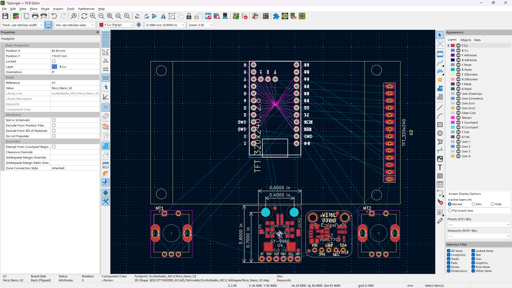
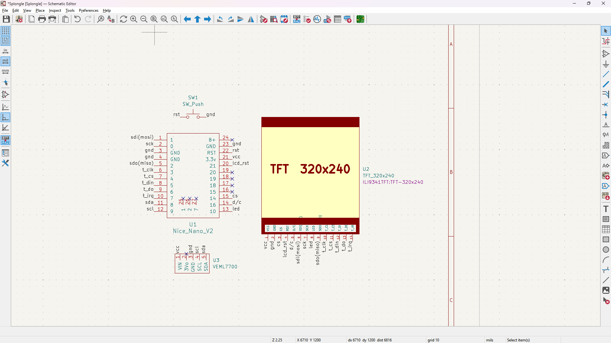

# Journal

- [Journal](#journal)
  - [16/08/2025](#16082025)
  - [17/08/2025](#17082025)
  - [18/08/2025](#18082025)
  - [19/08/2025](#19082025)
  - [20/08/2025](#20082025)
  - [24/08/2025](#24082025)
  - [30/08/2025](#30082025)
  - [31/08/2025](#31082025)
  - [09/09/2025](#09092025)
  - [20/09/2025](#20092025)

> [!NOTE]\
> Total time spent: **35h**

## 16/08/2025

Taking a while to sort out the parts. Definitely nice nano v2 clone for the main part. I could make it into a USB Hub w/ dongle thing. Not sure how 5V and 3.7V (or is it 3.3V I always get that mixed up somehow) would work - apparently linking up to the battery+ and battery- pins on the mcu are 3.7V (or 3.3V - you know what, ill just say not 5V supported lol).

Parts in Hardware inventory:
* Small Button - reset functionality for dongle part.
* Motion Sensor - gesture support?
* Encoder - volume etc control.
* 2.8" Touchscreen - actual screen for the dongle.

Parts:
* [nice! nano v2 clone](https://www.aliexpress.com/item/1005007738886550.html) - Cheaper than a Seeed XIAO nrf52840, which I need for ZMK and BLE. Also more GPIO so yeah. Although don't need a lot (or maybe I do).
* [Ambient Light Sensor](https://www.aliexpress.com/item/1005008725015234.html) - Auto change brightness of da LCD based on room brightness.

Ok finding a USB 3 (SPECIFICALLY 3) oops caps anyway but yeah finding one for USB 3 is annoying ;-;. Edit: yeah its fine USB 2 it is... USB 3 seems annoyingly long n stuff. And I'm mainly going to use this as a power device, and also to be like yo look I made this lol!

More parts from AliExpress:
* [SLA2.1A](https://www.aliexpress.com/item/1005006719525991.html) - The controller thingy for the USB hub part of the hub.
* [USB Type A Female Port](https://www.aliexpress.com/item/1005005865561469.html) - How stuff connects to the USB Hub.
* [USB Type A Male Connector](https://www.aliexpress.com/item/4001146122421.html) - To connect the USB Hub to a computer etc.

Ok I've decided not to do the USB Hub stuff because it only supports USB 2 which is eh. So the parts:

* nice! nano v2 clone.
* Ambient Light Sensor.
* Small reset button.
* Motion sensor - gesture support?
* Encoder(s) - volume control.
* Touchscreen.

> [!NOTE]\
> Total time spent: **3h**

## 17/08/2025

Ok going to actually use the Seeed XIAO ESP32C3 from the hardware inventory.

* XIAO ESP32-C3 (after starting w/ schematic will find out if enough GPIO lol).
* Ambient Light Sensor - VEML7700.
* Small reset button - small-button (inventory).
* Gesture sensor - GY-9960.
* Encoder(s) - EC11 (inventory).
* Touchscreen - 2.8" TFT LCD (inventory).

Found the [Adafruit schematics](https://github.com/adafruit/Adafruit-VEML7700-PCB?tab=readme-ov-file) for the VEML7700 - the AliExpress one I'm getting looks like just a clone of that, so I'm going to get the footprint from this repo (done this before for the Adafruit LiPo charger lol).

Imported it in:

Converted to a footprint:

Going to use a generic 6 pin connector probably for now. Thats what this schematic does anyway.

Damn, turns out somehow I already had a symbol for the screen, and it looks like a proper bosch one innit bruv (i.e., the description n stuff and like arrangement etc lol):

Note: don't connect VIN cus thats for 5V -> regulator, I'm 3.xV (which one is specifically lol) so connect to 3Vo to bypass regulator because its low enough.

Made a lil symbol for the VEML7700 based on the pin layout on da board from AliExpress / Adafruit:

> [!NOTE]\
> Total time spent: **5h**

## 18/08/2025

Added in 3D model for VEML7700 cus realised that might be useful :saluting_face:.

Seems close nough for the APDS-9960, slightly dif sized resistor or whatever but same PS and PU stuff: https://github.com/sparkfun/APDS-9960_RGB_and_Gesture_Sensor/. Footprint w/ 3D model for the sensor:

Ok, removing the fingerprint sensor tbh - will add that in a separate project for passwords / FIDO keys.

OK I guess I don't need a reset button cus the xiao comes with that...

Made a simple symbol for the GY-9960:

GY-9960 - by default jumper closed so VL and VCC connected so only the latter needs to be powered:

GY-9960 has built in pull up resistors - https://learn.sparkfun.com/tutorials/apds-9960-rgb-and-gesture-sensor-hookup-guide/all. Same for VEML7700 https://learn.adafruit.com/adafruit-veml7700?view=all & https://www.sparkfun.com/ambient-light-sensor-veml7700-qwiic.html.

Ok so a few problems - the footprint for the tft display is wrong - probably because their one doesn't specify touch, and so has less pins. Also, the XIAO should have RST etc buttons on the bottom but the 3D model has em on the top? I need more GPIO anyway so I'm going to switch to the nice!nano v2 (aliexpress [tm] clone).

GPIO without touch connected, even before rotary encoders! No space at all ;-;. And apparently they don't produce their IO expander anymore...

Had to edit the symbol because they didn't name the touch screen controller pins, so did that and linked up to the footprint.

> [!NOTE]\
> Total time spent: **6h**

## 19/08/2025

Added headers to the AliExpress.

So I was basically finished w/ the schematic (without encoders), but apparently the max output of a GPIO pin on the nice nano wont be enough to get the max backlight strenght so I may search for other MCUs.

Nevermind I am going to stick with the nice nano v2 cus its nrf52840 based so yeah, keep it consistent with the keeb. 

> [!NOTE]\
> Total time spent: **3h**

## 20/08/2025

Ok nevermind turns out the Vin is power _in_ who would have guessed ;-;. https://learn.adafruit.com/adafruit-veml7700/pinouts. So uh 3Vo is Output - wow, I'm so smart LOL.

New VELM7700 schematic section:

FINALLY finished the schematic ;-;:

> [!NOTE]\
> Total time spent: **3h**

## 24/08/2025

Few days later, sorry for the delay - I got my GCSE results on the 21st and after that have just been gaming a lot lol - I got 11 grade 9s (highest grade possible - A* equivalent), and only 116 children in total achieved that in the whole of England :0.

Rough pcb part placement, to base fusion 360 case design of (not wired yet if i move stuff):

Had to fix the bottom of some components cutting out from the PCB due to Edge.Cuts:

> [!NOTE]\
> Total time spent: **4h**

## 30/08/2025

Had to recreate Edge.Cuts for VEML 7700 because it cut through the board.

> [!NOTE]\
> Total time spent: **2h**

## 31/08/2025

Redid layout, going to use some right angle pins.

> [!NOTE]\
> Total time spent: **2h**

## 09/09/2025

So school started and there's too much work. I want 
to try to finish this ASAP. So, I'm removing the GY-9960 as it allows a much better design tbh, keeping the other one for ambient light sensing though.

> [!NOTE]\
> Total time spent: **3h**

## 20/09/2025

FINALLY FINISHED.

> [!NOTE]\
> Total time spent: **3h**