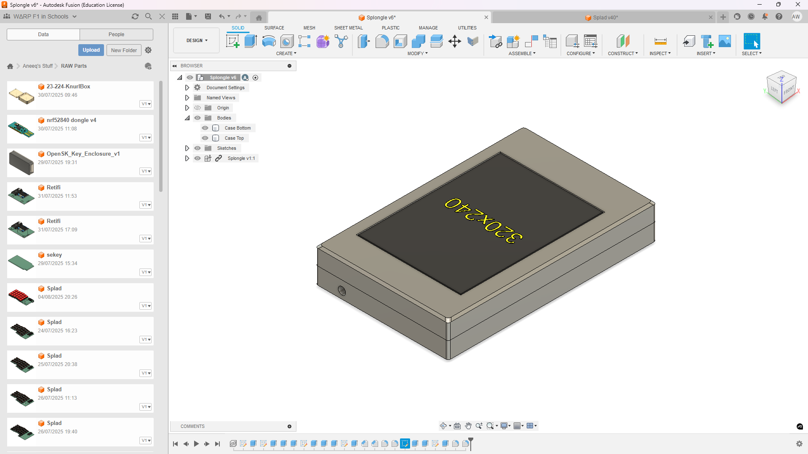
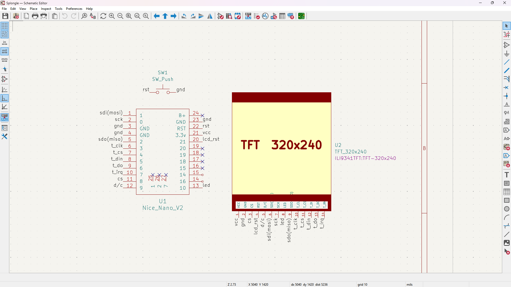
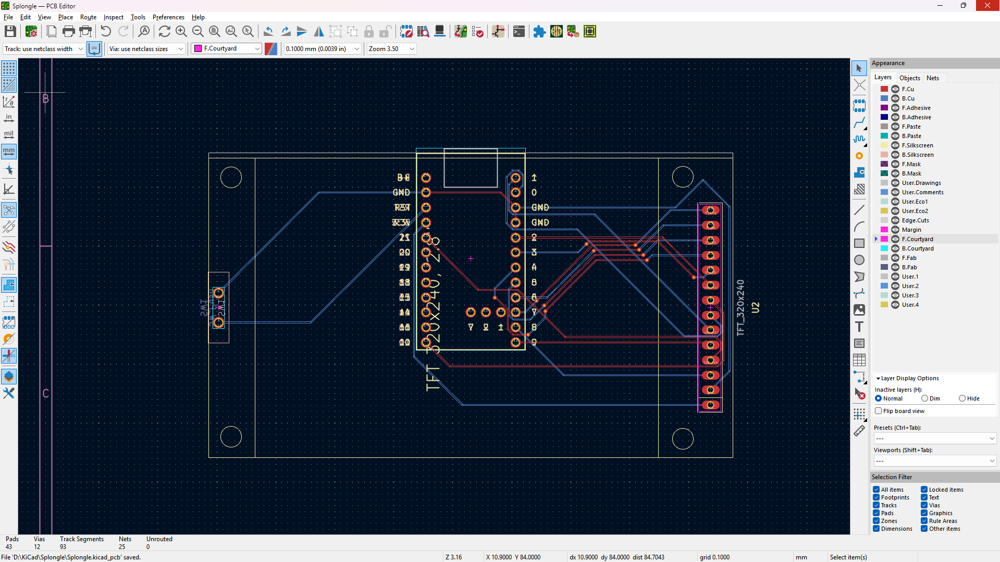

# splongle

- [splongle](#splongle)
  - [Schematic](#schematic)
  - [PCB](#pcb)
  - [BOM](#bom)

A dongle for my [split ergonomic keyboard](https://github.com/skifli/splad).

## Schematic

## PCB

## BOM

| Item                                               | Price (GBP) |
| -------------------------------------------------- | ----------- |
| 2.8" ILI9341 display                               | £6.25       |
| 3×3 mm fridge magnets (for the two case halves)    | £2.71       |
| 1×3 pin, 50 pcs (for Nice!Nano 3-pin part for PCB) | £0.92       |
| Nice!Nano clone                                    | £3.33       |
| **Total**                                          | **£13.21**  |

**Total in USD:** $17.80
